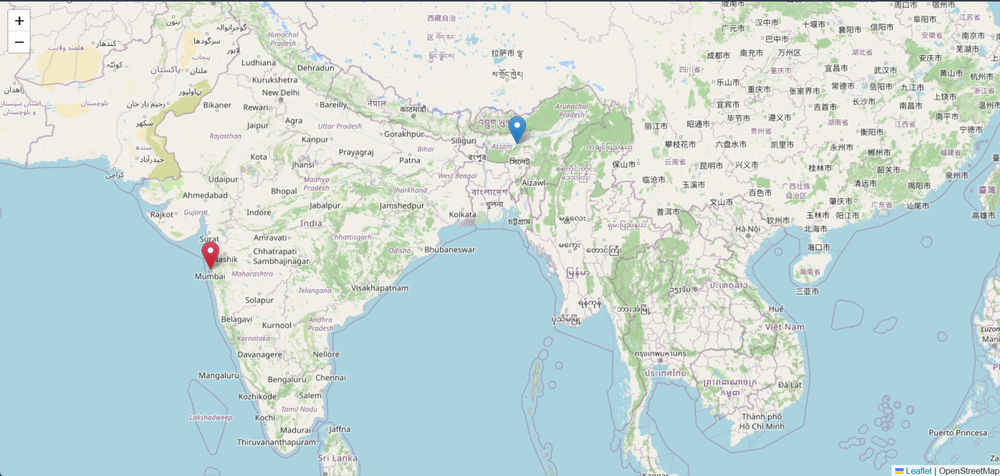
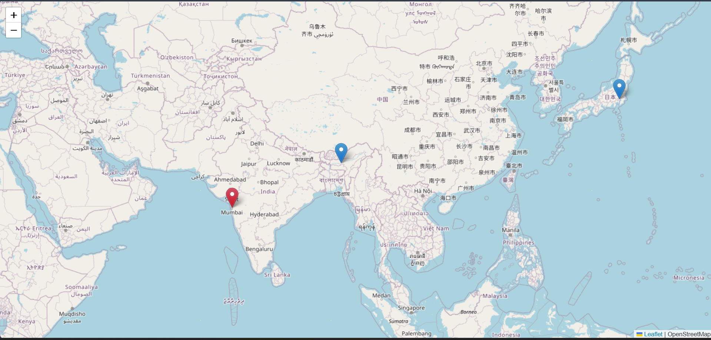

# Real-Time Tracking App

A real-time tracking application using **Node.js**, **Express**, **Socket.IO**, and **Leaflet** for interactive maps. This project demonstrates how to track and visualize geographic locations in real-time across multiple devices connected to the same server.

## Screenshots





## Features

- **Live Location Tracking**: Uses browser Geolocation API to continuously monitor and share position updates.
- **Real-Time Map Synchronization**: Devices immediately broadcast their location to all other connected clients using **Socket.IO**.
- **Visual Differentiation**: 
  - Your own device appears as a **Red** marker.
  - Other connected devices appear as **Blue** markers.
- **Marker Identification**: Click on any marker to see who it belongs to ("You" vs "User [ID]").
- **State Persistence**: The server remembers the last known locations of everyone connected. When a new device joins, it instantly populates their map without having to wait for existing users to move.
- **Auto-Cleanup**: When a user closes the app or disconnects, their marker is instantly removed from everyone's map.

## Technologies Used

- **Node.js**: JavaScript runtime environment
- **Express**: Web framework for serving the application
- **Socket.IO**: Real-time, bidirectional, and event-based communication
- **Leaflet**: Open-source JavaScript library for mobile-friendly interactive maps
- **EJS**: Embedded JavaScript templating for views

## How to Run Locally

1. **Install dependencies**:
   Make sure you have Node.js installed. Open a terminal in the `realtime_tracker` directory and run:
   ```bash
   npm install
   ```

2. **Start the server**:
   ```bash
   node app.js
   ```

3. **Open the app**:
   Open your web browser and go to:
   ```
   http://localhost:3000
   ```
   *(Note: You must allow the browser to access your location when prompted)*

## Testing with Multiple Devices

To truly see the real-time tracking in action, connect multiple devices:

1. Connect your phone (or another computer) to the **same WiFi network** as the computer running the server.
2. Find your computer's local IP address (e.g., `192.168.x.x`).
3. On your phone's browser, go to `http://<YOUR_IP_ADDRESS>:3000`.
4. Allow location permissions.
5. You will instantly see your computer's marker on your phone, and your phone's marker will pop up on your computer's screen!


